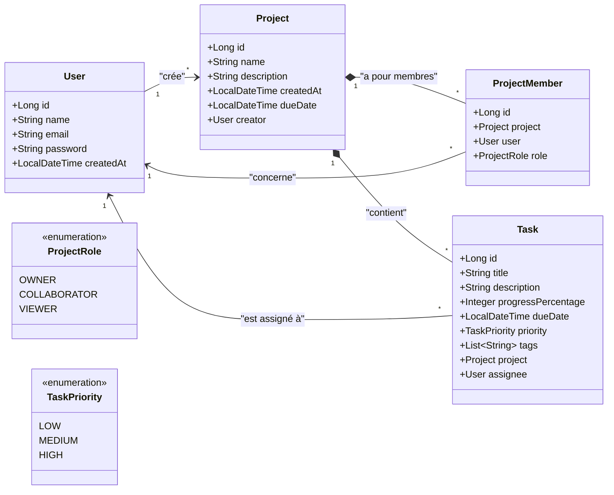

# Together1 API - Application de Gestion de Tâches Collaborative

Together1 API est le backend d'une plateforme de gestion de tâches collaborative inspirée d'outils comme Mantis, Jira et Trello. L'application permet à des utilisateurs de créer des projets, d'inviter des collaborateurs et de suivre l'avancement des tâches en fonction de rôles précis.

---

## Fonctionnalités principales

- **Gestion des Utilisateurs** : Inscription, connexion et profil utilisateur.
- **Gestion des Projets** : Création de projets et gestion des membres associés.
- **Système de Rôles & Permissions** :
  - **OWNER** : Créateur du projet avec un contrôle total.
  - **COLLABORATOR** : Membre invité pouvant ajouter des tâches et modifier leur statut.
  - **VIEWER** : Membre en lecture seule (consultation uniquement).
- **Gestion des Tâches** : Création de tâches, assignation à un membre, description, et suivi de la progression (de 0 à 100%).

---

## Stack Technique

- **Langage** : Java 21
- **Framework Principal** : Spring Boot 4.x
- **Persistance & Données** : Spring Data JPA (Hibernate)
- **Base de Données** : PostgreSQL
- **Utilitaires** : Lombok (génération automatique des getters, setters, constructeurs)
- **Gestionnaire de dépendances** : Maven

---

## Modèle de Données

Voici l'architecture relationnelle des entités du projet :



---

## Configuration & Démarrage

### Prérequis
- **Java 21** ou version supérieure installé.
- **PostgreSQL** installé et en cours d'exécution.

### 1. Configuration de la base de données
Assurez-vous que la base de données `together1` existe dans votre PostgreSQL local. Vous pouvez la créer avec la commande SQL suivante :
```sql
CREATE DATABASE together1;
```

Les paramètres de connexion sont définis dans le fichier [application.properties](src/main/resources/application.properties) :
```properties
spring.datasource.url=jdbc:postgresql://localhost:5432/together1
spring.datasource.username=postgres
spring.datasource.password=manoa
spring.jpa.hibernate.ddl-auto=update
```

### 2. Lancement du serveur backend
Pour démarrer le projet en mode développement, ouvrez un terminal à la racine du projet et exécutez :

```powershell
./mvnw spring-boot:run
```

Le serveur sera accessible par défaut à l'adresse : `http://localhost:8080`
